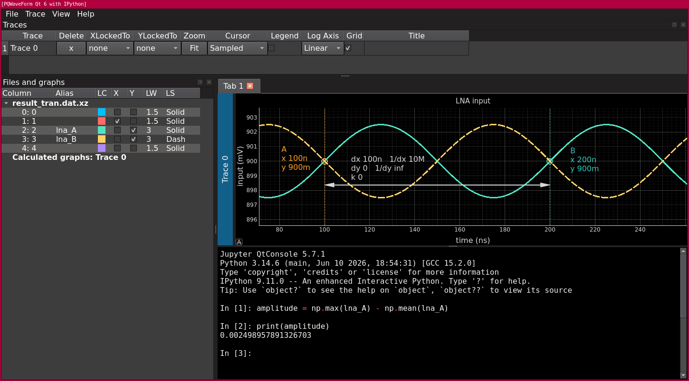
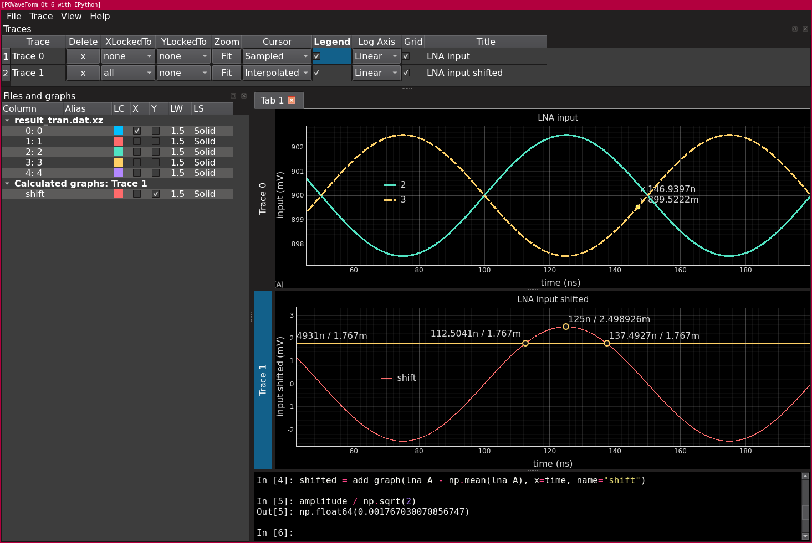

# PQWaveForm

An analog waveform viewer, data-analysis workbench, and documentation
tool for simulation and measurement data not just for IC-designers.

> **License notice**
>
> PQWaveForm is currently licensed under **GPL-3.0** because it uses
> **PyQt6**. A future switch to **PySide6** may allow the project to move
> to a more permissive **MIT license** if that becomes desirable.
>
> This project originated from a privately maintained waveform-viewer
> codebase that evolved over many years. During the recent development
> process, large parts of the implementation were replaced through
> extensive AI-assisted "vibe coding". As a result, it is no longer clear
> how much of the original code remains.

## Motivation

PQWaveForm was created to fill a practical gap: a lightweight and free
waveform viewer that makes it easy to load simulation results, inspect
measurement data, perform quick calculations, and generate
publication-ready plots without complex setup.

What started as a personal tool for small electronics projects has grown
into a powerful environment for:

- Simulation waveform inspection
- Measurement data visualization
- Interactive data analysis
- Automated curve processing
- Documentation and report generation
- Reproducible engineering workflows

A key design goal is that plots should not only look good today but also
be reproducible months later when measurements or simulations are
repeated.

---

## Key Features

### Multi-Trace Waveform Viewer

- Multiple traces per workspace
- Multiple trace tabs
- Independent X-axis selection per file
- Linear and logarithmic axes
- Engineering SI notation
- Synchronized axis linking
- Adjustable trace heights

### Flexible Data Import

Supports:

- CSV
- TSV
- Compressed files (.gz, .bz2, .xz, .zip, .zst, ...)

If automatic import fails, an import dialog allows separators, header
rows, comments, skipped lines, and column assignments to be corrected
interactively.

### Interactive Measurement Tools

- Live waveform tracker (sample mode, interpolation mode)
- A/B measurement marker
- Horizontal and vertical intersection markers
- Draggable labels
- Engineering-unit display

### Embedded IPython Console

One of the project's most important features is the fully embedded
IPython/Jupyter console.

The console has direct access to loaded waveforms and calculated graphs.

Examples:

```python
gain = vout / vin
add_graph(gain, x=time, name="Gain")
```

```python
new_trace(
    np.gradient(vout, time),
    x=time,
    trace_name="Derivative"
)
```

Aliases make frequently used signals easy to access (aliases are
automatically extracted from a CSV header line). To check for available
aliases and API function names use `%who`:

```python 
%who 
active_trace	 add_graph	 add_marker_h	
add_marker_v	 add_trace	 clear_alias	 clear_all_aliases	
clear_all_files	 clear_traces	  load_python_file	 new_trace	
np	 pd	 project	 prune_aliases	 rect	 remove_graph	
save_all_traces	  save_graph	 save_trace	 save_traces	
set_axis	 set_graph_as_x	 set_graph_style	 step	 wave	
waveN	 
```

### Calculated Graphs

Calculated graphs are first-class project objects.

They support:

- Independent X/Y arrays
- Aliases
- Visibility control
- Custom line styles
- Custom colors
- Legends
- Export
- Use as X-axis sources

### User Python Extensions

Custom Python files can be loaded directly into the embedded
environment.

Example:

```python
load_python_file("my_analysis.py")
```

This allows project-specific evaluation functions, fitting routines,
measurement processing, or custom post-processing pipelines.

### History & Reproducibility

A major focus of PQWaveForm is reproducibility.

The history system stores:

- Loaded files
- Trace configuration
- Visible curves
- Tabs
- Axis settings
- Markers
- Label positions
- Legend positions
- Window layout
- IPython code
- Calculated graph metadata

A previously saved state can later be restored to recreate the analysis
environment as accurately as possible.

This is especially useful when new measurements are taken and compared
to previous results.

### Export & Documentation

PQWaveForm is no longer only a waveform viewer.

It is also heavily used as a documentation tool.

Features include:

- CSV export
- TSV export
- SVG vector export
- PDF vector export
- Multi-trace export layouts
- Custom plot titles
- Editable legends

The PDF/SVG export pipeline focuses on high-quality vector graphics
suitable for engineering documentation.

---

## Typical Workflow

1. Load measurement or simulation data.
2. Enable the desired signals.
3. Analyze data with markers and trackers.
4. Generate derived curves in IPython.
5. Save the project state to history.
6. Export the final plot as SVG or PDF.

---

## Screenshots

### Main Application Window



### Analysis and Documentation Example



---

## Example: Create a Gain Curve

```python
gain = vout / vin
add_graph(
    gain,
    x=time,
    name="Gain",
    alias="gain"
)
```

## Example: Add an Intersection Marker

```python
add_marker_h(0.3)
add_marker_v(1e-3)
```

## Example: Export Data

```python
save_trace(0, "result.csv")
save_all_traces("all_traces.csv.gz")
```

---

## Technology

- Python
- PyQt6
- PyQtGraph
- NumPy
- pandas
- IPython
- QtConsole

---

## Project Status

PQWaveForm is an actively evolving engineering tool developed primarily
to support practical simulation, measurement, evaluation, and
documentation workflows.

Feedback, bug reports, and contributions are welcome.
